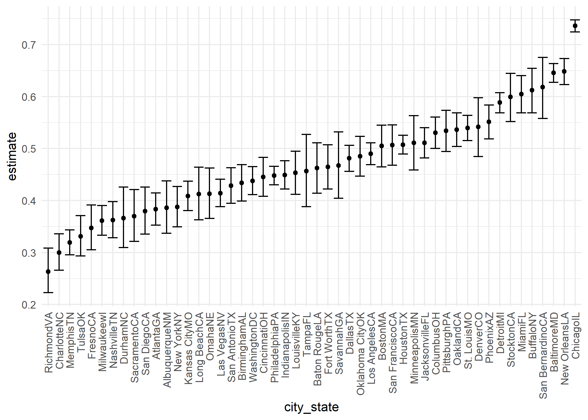
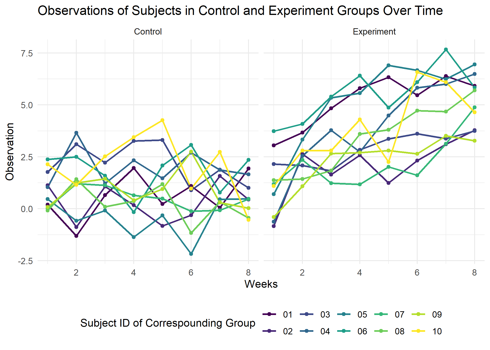

p8105\_hw5\_wz2590
================
Weiheng Zhang
2021/11/11

``` r
library(tidyverse)
library(dplyr)
library(patchwork)

theme_set(theme_minimal() + theme(legend.position = "bottom"))

options(
  ggplot2.continuous.colour = "viridis",
  ggplot2.continuous.fill = "viridis"
)

scale_colour_discrete = scale_color_viridis_d
scale_fill_discrete = scale_fill_viridis_d
```

## Problem 1, following the instructions in the office hour.

We will analyze the data published by *The Washington Post* on homicides
in 50 large U.S. cities.

``` r
homicide_df = 
  read_csv("./data/Problem1/homicide-data.csv", na = c("", "Unknown")) %>% 
  mutate(
    city_state = str_c(city, state),
    resolution = case_when(
      disposition == "Closed without arrest" ~ "unsolved",
      disposition == "Open/No arrest" ~ "unsolved",
      disposition == "Closed by arrest" ~ "solved",
    )) %>% 
  relocate(city_state) %>% 
  filter(city_state != "TulsaAL")
```

Let’s focus on Baltimore, MD.

``` r
baltimore_df =
  homicide_df %>% 
  filter(city_state == "BaltimoreMD")

baltimore_summmary = 
  baltimore_df %>% 
  summarize(
    unsolved = sum(resolution == "unsolved"),
    n = n()
  )

baltimore_test = 
  prop.test(
    x = baltimore_summmary %>% pull(unsolved), 
    n = baltimore_summmary %>% pull(n))

baltimore_test %>% 
  broom::tidy()
```

    ## # A tibble: 1 x 8
    ##   estimate statistic  p.value parameter conf.low conf.high method    alternative
    ##      <dbl>     <dbl>    <dbl>     <int>    <dbl>     <dbl> <chr>     <chr>      
    ## 1    0.646      239. 6.46e-54         1    0.628     0.663 1-sample~ two.sided

Let’s try to iterate across cities! Firstly, write a function and test
it on a few sample cities.

``` r
prop_test_function = function(city_df){
  city_summary = 
    city_df %>% 
    summarize(
      unsolved = sum(resolution == "unsolved"),
      n = n()
    )
  
  city_test = 
    prop.test(
      x = city_summary %>% pull(unsolved),
      n = city_summary %>% pull(n)
      )
  
  return(city_test)
  
}

prop_test_function(baltimore_df)
```

    ## 
    ##  1-sample proportions test with continuity correction
    ## 
    ## data:  city_summary %>% pull(unsolved) out of city_summary %>% pull(n), null probability 0.5
    ## X-squared = 239.01, df = 1, p-value < 2.2e-16
    ## alternative hypothesis: true p is not equal to 0.5
    ## 95 percent confidence interval:
    ##  0.6275625 0.6631599
    ## sample estimates:
    ##         p 
    ## 0.6455607

``` r
homicide_df %>% 
  filter(city_state == "AlbuquerqueNM") %>% 
  prop_test_function()
```

    ## 
    ##  1-sample proportions test with continuity correction
    ## 
    ## data:  city_summary %>% pull(unsolved) out of city_summary %>% pull(n), null probability 0.5
    ## X-squared = 19.114, df = 1, p-value = 1.232e-05
    ## alternative hypothesis: true p is not equal to 0.5
    ## 95 percent confidence interval:
    ##  0.3372604 0.4375766
    ## sample estimates:
    ##         p 
    ## 0.3862434

Now, let’s iterate across all cities,

``` r
results_df = 
  homicide_df %>% 
  nest(data = uid:resolution) %>% 
  mutate(
    test_results = map(data, prop_test_function),
    tidy_results = map(test_results, broom::tidy)
  ) %>% 
  select(city_state, tidy_results) %>% 
  unnest(tidy_results) %>% 
  select(city_state, estimate, starts_with("conf"))
```

Try to make a plot showing estimates and confidence intervals.

``` r
results_df %>% 
  mutate(city_state = fct_reorder(city_state, estimate)) %>% 
  ggplot(aes(x = city_state, y = estimate)) +
  geom_point() +
  geom_errorbar(aes(ymin = conf.low, ymax = conf.high)) +
  theme(axis.text.x = element_text(angle = 90, vjust = 0.5, hjust = 1))
```

<!-- -->

An alternative way for problem 1:

``` r
homicide_df %>% 
  group_by(city_state) %>% 
  summarize(
    unsolved = sum(resolution == "unsolved"),
    n = n()
  ) %>% 
  mutate(
    test_results = map2(unsolved, n, prop.test),
    tidy_results = map(test_results, broom::tidy)
  ) %>% 
  select(city_state, tidy_results) %>% 
  unnest(tidy_results) %>% 
  select(city_state, estimate, starts_with("conf"))
```

    ## # A tibble: 50 x 4
    ##    city_state    estimate conf.low conf.high
    ##    <chr>            <dbl>    <dbl>     <dbl>
    ##  1 AlbuquerqueNM    0.386    0.337     0.438
    ##  2 AtlantaGA        0.383    0.353     0.415
    ##  3 BaltimoreMD      0.646    0.628     0.663
    ##  4 Baton RougeLA    0.462    0.414     0.511
    ##  5 BirminghamAL     0.434    0.399     0.469
    ##  6 BostonMA         0.505    0.465     0.545
    ##  7 BuffaloNY        0.612    0.569     0.654
    ##  8 CharlotteNC      0.300    0.266     0.336
    ##  9 ChicagoIL        0.736    0.724     0.747
    ## 10 CincinnatiOH     0.445    0.408     0.483
    ## # ... with 40 more rows

## Problem 2

Use iteration to read in the data files and do some data cleaning.

``` r
longitudinal_df = 
  tibble(
    path = list.files("data/Problem2")) %>% 
  mutate(
    path = str_c("data/Problem2/", path),
    data = map(path, read_csv)) %>% 
  separate(path, c(NA, NA,"name"), sep = "/") %>% 
  separate(name, c("Arm","Subject_ID", NA)) %>% 
  mutate(Arm = recode(Arm, con = "Control", exp = "Experiment")) %>% 
  unnest(data)
longitudinal_df
```

    ## # A tibble: 20 x 10
    ##    Arm        Subject_ID week_1 week_2 week_3 week_4 week_5 week_6 week_7 week_8
    ##    <chr>      <chr>       <dbl>  <dbl>  <dbl>  <dbl>  <dbl>  <dbl>  <dbl>  <dbl>
    ##  1 Control    01           0.2   -1.31   0.66   1.96   0.23   1.09   0.05   1.94
    ##  2 Control    02           1.13  -0.88   1.07   0.17  -0.83  -0.31   1.58   0.44
    ##  3 Control    03           1.77   3.11   2.22   3.26   3.31   0.89   1.88   1.01
    ##  4 Control    04           1.04   3.66   1.22   2.33   1.47   2.7    1.87   1.66
    ##  5 Control    05           0.47  -0.58  -0.09  -1.37  -0.32  -2.17   0.45   0.48
    ##  6 Control    06           2.37   2.5    1.59  -0.16   2.08   3.07   0.78   2.35
    ##  7 Control    07           0.03   1.21   1.13   0.64   0.49  -0.12  -0.07   0.46
    ##  8 Control    08          -0.08   1.42   0.09   0.36   1.18  -1.16   0.33  -0.44
    ##  9 Control    09           0.08   1.24   1.44   0.41   0.95   2.75   0.3    0.03
    ## 10 Control    10           2.14   1.15   2.52   3.44   4.26   0.97   2.73  -0.53
    ## 11 Experiment 01           3.05   3.67   4.84   5.8    6.33   5.46   6.38   5.91
    ## 12 Experiment 02          -0.84   2.63   1.64   2.58   1.24   2.32   3.11   3.78
    ## 13 Experiment 03           2.15   2.08   1.82   2.84   3.36   3.61   3.37   3.74
    ## 14 Experiment 04          -0.62   2.54   3.78   2.73   4.49   5.82   6      6.49
    ## 15 Experiment 05           0.7    3.33   5.34   5.57   6.9    6.66   6.24   6.95
    ## 16 Experiment 06           3.73   4.08   5.4    6.41   4.87   6.09   7.66   5.83
    ## 17 Experiment 07           1.18   2.35   1.23   1.17   2.02   1.61   3.13   4.88
    ## 18 Experiment 08           1.37   1.43   1.84   3.6    3.8    4.72   4.68   5.7 
    ## 19 Experiment 09          -0.4    1.08   2.66   2.7    2.8    2.64   3.51   3.27
    ## 20 Experiment 10           1.09   2.8    2.8    4.3    2.25   6.57   6.09   4.64

convert to long format for graphing in the next step.

``` r
longitudinal_long = longitudinal_df %>% 
  pivot_longer(week_1:week_8,
               names_prefix = "week_",
               names_to = "Week",
               values_to = "Observation") %>% 
  mutate(Week = as.numeric(Week))

longitudinal_long
```

    ## # A tibble: 160 x 4
    ##    Arm     Subject_ID  Week Observation
    ##    <chr>   <chr>      <dbl>       <dbl>
    ##  1 Control 01             1        0.2 
    ##  2 Control 01             2       -1.31
    ##  3 Control 01             3        0.66
    ##  4 Control 01             4        1.96
    ##  5 Control 01             5        0.23
    ##  6 Control 01             6        1.09
    ##  7 Control 01             7        0.05
    ##  8 Control 01             8        1.94
    ##  9 Control 02             1        1.13
    ## 10 Control 02             2       -0.88
    ## # ... with 150 more rows

Make a spaghetti plot showing observations on each subject over time,
and comment on differences between groups.

``` r
longitudinal_long %>% 
  ggplot(aes(x = Week, y = Observation, group = Subject_ID, color = Subject_ID)) +
  geom_line(size = 0.8) + 
  geom_point() +
  labs(
    title = "Observations of Subjects in Control and Experiment Groups Over Time",
    x = "Weeks",
    y = "Observation",
    color = "Subject ID of Correspounding Group"
  ) +
  facet_grid(. ~ Arm)
```

<!-- -->
Generally, the observations of each subject in the experimental group
increases over time, while subjects in the control group does not show
clear association between time and observation. Overall, observations of
subjects in the experimental group are higher than observations of
subjects in the control group, during the study period.

## Problem 3

``` r
set.seed(10)

iris_with_missing = iris %>% 
  map_df(~replace(.x, sample(1:150, 20), NA)) %>%
  mutate(Species = as.character(Species))
iris_with_missing
```

    ## # A tibble: 150 x 5
    ##    Sepal.Length Sepal.Width Petal.Length Petal.Width Species
    ##           <dbl>       <dbl>        <dbl>       <dbl> <chr>  
    ##  1          5.1         3.5          1.4         0.2 setosa 
    ##  2          4.9         3            1.4         0.2 setosa 
    ##  3          4.7         3.2          1.3         0.2 setosa 
    ##  4          4.6         3.1          1.5        NA   setosa 
    ##  5          5           3.6          1.4         0.2 setosa 
    ##  6          5.4         3.9          1.7         0.4 setosa 
    ##  7         NA           3.4          1.4         0.3 setosa 
    ##  8          5           3.4          1.5         0.2 setosa 
    ##  9          4.4         2.9          1.4         0.2 setosa 
    ## 10          4.9         3.1         NA           0.1 setosa 
    ## # ... with 140 more rows

Write a function that takes a vector as an argument; replaces missing
values using the rules defined; and returns the resulting vector. Apply
this function to the columns of iris\_with\_missing using a map
statement.

``` r
iris_fill = function(vec) {
  length = length(vec)
  
  if (is.numeric(vec)) {
    mean = mean(vec, na.rm = T) %>% 
      round(digits = 1)
    for (i in 1:length) {
      if (is.na(vec[i])) {
        vec[i] = mean
      }
    }
  }
  
  else if (is.character(vec)) {
    for (i in 1:length) {
      if (is.na(vec[i])) {
        vec[i] = "virginica"
      }
    }
  }
  
  return(vec)
  
}

results = map(iris_with_missing, iris_fill)
as_tibble(results) %>% 
  knitr::kable()
```

| Sepal.Length | Sepal.Width | Petal.Length | Petal.Width | Species    |
|-------------:|------------:|-------------:|------------:|:-----------|
|          5.1 |         3.5 |          1.4 |         0.2 | setosa     |
|          4.9 |         3.0 |          1.4 |         0.2 | setosa     |
|          4.7 |         3.2 |          1.3 |         0.2 | setosa     |
|          4.6 |         3.1 |          1.5 |         1.2 | setosa     |
|          5.0 |         3.6 |          1.4 |         0.2 | setosa     |
|          5.4 |         3.9 |          1.7 |         0.4 | setosa     |
|          5.8 |         3.4 |          1.4 |         0.3 | setosa     |
|          5.0 |         3.4 |          1.5 |         0.2 | setosa     |
|          4.4 |         2.9 |          1.4 |         0.2 | setosa     |
|          4.9 |         3.1 |          3.8 |         0.1 | setosa     |
|          5.4 |         3.1 |          1.5 |         0.2 | setosa     |
|          4.8 |         3.4 |          1.6 |         0.2 | setosa     |
|          5.8 |         3.1 |          1.4 |         0.1 | setosa     |
|          4.3 |         3.0 |          3.8 |         0.1 | setosa     |
|          5.8 |         4.0 |          3.8 |         0.2 | setosa     |
|          5.7 |         4.4 |          1.5 |         0.4 | setosa     |
|          5.4 |         3.9 |          1.3 |         0.4 | setosa     |
|          5.1 |         3.5 |          1.4 |         1.2 | setosa     |
|          5.7 |         3.8 |          1.7 |         0.3 | setosa     |
|          5.1 |         3.8 |          1.5 |         1.2 | setosa     |
|          5.4 |         3.4 |          1.7 |         0.2 | setosa     |
|          5.1 |         3.7 |          1.5 |         0.4 | virginica  |
|          4.6 |         3.6 |          1.0 |         0.2 | setosa     |
|          5.8 |         3.3 |          3.8 |         0.5 | setosa     |
|          4.8 |         3.4 |          1.9 |         0.2 | virginica  |
|          5.0 |         3.0 |          3.8 |         0.2 | setosa     |
|          5.0 |         3.4 |          1.6 |         0.4 | virginica  |
|          5.2 |         3.5 |          1.5 |         0.2 | setosa     |
|          5.8 |         3.4 |          1.4 |         0.2 | setosa     |
|          4.7 |         3.2 |          1.6 |         0.2 | setosa     |
|          4.8 |         3.1 |          3.8 |         0.2 | setosa     |
|          5.4 |         3.1 |          1.5 |         0.4 | setosa     |
|          5.2 |         3.1 |          1.5 |         0.1 | setosa     |
|          5.5 |         4.2 |          1.4 |         0.2 | setosa     |
|          4.9 |         3.1 |          3.8 |         0.2 | setosa     |
|          5.0 |         3.2 |          1.2 |         0.2 | setosa     |
|          5.5 |         3.5 |          1.3 |         0.2 | setosa     |
|          4.9 |         3.6 |          1.4 |         0.1 | setosa     |
|          4.4 |         3.0 |          1.3 |         1.2 | setosa     |
|          5.1 |         3.4 |          1.5 |         0.2 | setosa     |
|          5.0 |         3.5 |          1.3 |         0.3 | setosa     |
|          4.5 |         3.1 |          1.3 |         1.2 | virginica  |
|          4.4 |         3.2 |          1.3 |         0.2 | setosa     |
|          5.0 |         3.5 |          1.6 |         0.6 | setosa     |
|          5.1 |         3.8 |          1.9 |         0.4 | setosa     |
|          4.8 |         3.0 |          1.4 |         0.3 | virginica  |
|          5.1 |         3.8 |          1.6 |         0.2 | setosa     |
|          4.6 |         3.2 |          3.8 |         0.2 | setosa     |
|          5.3 |         3.7 |          1.5 |         0.2 | setosa     |
|          5.0 |         3.1 |          1.4 |         0.2 | setosa     |
|          7.0 |         3.1 |          4.7 |         1.4 | virginica  |
|          6.4 |         3.2 |          4.5 |         1.5 | versicolor |
|          6.9 |         3.1 |          4.9 |         1.5 | versicolor |
|          5.5 |         2.3 |          4.0 |         1.3 | versicolor |
|          6.5 |         2.8 |          4.6 |         1.5 | versicolor |
|          5.7 |         2.8 |          4.5 |         1.3 | versicolor |
|          6.3 |         3.3 |          4.7 |         1.6 | virginica  |
|          4.9 |         2.4 |          3.8 |         1.0 | versicolor |
|          6.6 |         2.9 |          4.6 |         1.3 | virginica  |
|          5.2 |         2.7 |          3.9 |         1.4 | versicolor |
|          5.0 |         2.0 |          3.8 |         1.0 | versicolor |
|          5.9 |         3.0 |          4.2 |         1.5 | versicolor |
|          6.0 |         2.2 |          4.0 |         1.2 | versicolor |
|          6.1 |         2.9 |          4.7 |         1.4 | versicolor |
|          5.6 |         2.9 |          3.6 |         1.3 | versicolor |
|          6.7 |         3.1 |          4.4 |         1.4 | versicolor |
|          5.6 |         3.0 |          4.5 |         1.5 | versicolor |
|          5.8 |         3.1 |          4.1 |         1.0 | versicolor |
|          6.2 |         2.2 |          4.5 |         1.5 | versicolor |
|          5.6 |         2.5 |          3.9 |         1.1 | versicolor |
|          5.9 |         3.2 |          4.8 |         1.8 | versicolor |
|          5.8 |         2.8 |          4.0 |         1.3 | virginica  |
|          6.3 |         2.5 |          4.9 |         1.5 | versicolor |
|          5.8 |         2.8 |          3.8 |         1.2 | versicolor |
|          6.4 |         2.9 |          4.3 |         1.3 | versicolor |
|          6.6 |         3.0 |          4.4 |         1.4 | versicolor |
|          6.8 |         2.8 |          4.8 |         1.4 | versicolor |
|          6.7 |         3.1 |          5.0 |         1.2 | versicolor |
|          6.0 |         3.1 |          4.5 |         1.2 | versicolor |
|          5.7 |         2.6 |          3.5 |         1.0 | virginica  |
|          5.5 |         2.4 |          3.8 |         1.1 | versicolor |
|          5.8 |         2.4 |          3.7 |         1.0 | versicolor |
|          5.8 |         2.7 |          3.9 |         1.2 | versicolor |
|          6.0 |         2.7 |          5.1 |         1.6 | versicolor |
|          5.4 |         3.0 |          4.5 |         1.5 | versicolor |
|          5.8 |         3.4 |          4.5 |         1.6 | versicolor |
|          6.7 |         3.1 |          4.7 |         1.2 | versicolor |
|          5.8 |         3.1 |          4.4 |         1.3 | versicolor |
|          5.6 |         3.0 |          3.8 |         1.2 | versicolor |
|          5.5 |         2.5 |          4.0 |         1.2 | versicolor |
|          5.5 |         3.1 |          4.4 |         1.2 | versicolor |
|          5.8 |         3.1 |          4.6 |         1.2 | versicolor |
|          5.8 |         3.1 |          4.0 |         1.2 | versicolor |
|          5.0 |         2.3 |          3.3 |         1.2 | virginica  |
|          5.8 |         2.7 |          4.2 |         1.3 | versicolor |
|          5.7 |         3.0 |          4.2 |         1.2 | versicolor |
|          5.7 |         2.9 |          4.2 |         1.3 | versicolor |
|          6.2 |         2.9 |          4.3 |         1.3 | versicolor |
|          5.1 |         2.5 |          3.0 |         1.2 | versicolor |
|          5.7 |         2.8 |          4.1 |         1.3 | virginica  |
|          6.3 |         3.1 |          3.8 |         2.5 | virginica  |
|          5.8 |         2.7 |          5.1 |         1.9 | virginica  |
|          7.1 |         3.0 |          5.9 |         2.1 | virginica  |
|          6.3 |         2.9 |          5.6 |         1.8 | virginica  |
|          6.5 |         3.1 |          5.8 |         2.2 | virginica  |
|          7.6 |         3.0 |          6.6 |         2.1 | virginica  |
|          4.9 |         2.5 |          4.5 |         1.7 | virginica  |
|          7.3 |         2.9 |          6.3 |         1.8 | virginica  |
|          6.7 |         3.1 |          3.8 |         1.8 | virginica  |
|          5.8 |         3.6 |          3.8 |         2.5 | virginica  |
|          6.5 |         3.2 |          5.1 |         2.0 | virginica  |
|          5.8 |         2.7 |          5.3 |         1.9 | virginica  |
|          6.8 |         3.0 |          5.5 |         2.1 | virginica  |
|          5.7 |         3.1 |          5.0 |         2.0 | virginica  |
|          5.8 |         2.8 |          5.1 |         2.4 | virginica  |
|          6.4 |         3.2 |          5.3 |         2.3 | virginica  |
|          6.5 |         3.0 |          3.8 |         1.8 | virginica  |
|          7.7 |         3.8 |          6.7 |         1.2 | virginica  |
|          7.7 |         2.6 |          6.9 |         2.3 | virginica  |
|          6.0 |         2.2 |          5.0 |         1.5 | virginica  |
|          5.8 |         3.2 |          5.7 |         1.2 | virginica  |
|          5.6 |         3.1 |          4.9 |         2.0 | virginica  |
|          7.7 |         2.8 |          6.7 |         2.0 | virginica  |
|          6.3 |         2.7 |          4.9 |         1.8 | virginica  |
|          6.7 |         3.3 |          5.7 |         2.1 | virginica  |
|          7.2 |         3.2 |          6.0 |         1.8 | virginica  |
|          6.2 |         2.8 |          4.8 |         1.8 | virginica  |
|          6.1 |         3.0 |          4.9 |         1.8 | virginica  |
|          6.4 |         2.8 |          5.6 |         2.1 | virginica  |
|          7.2 |         3.0 |          5.8 |         1.6 | virginica  |
|          7.4 |         2.8 |          6.1 |         1.2 | virginica  |
|          7.9 |         3.8 |          3.8 |         2.0 | virginica  |
|          6.4 |         2.8 |          3.8 |         2.2 | virginica  |
|          5.8 |         2.8 |          5.1 |         1.5 | virginica  |
|          6.1 |         3.1 |          5.6 |         1.4 | virginica  |
|          5.8 |         3.0 |          6.1 |         2.3 | virginica  |
|          5.8 |         3.4 |          5.6 |         1.2 | virginica  |
|          6.4 |         3.1 |          5.5 |         1.2 | virginica  |
|          6.0 |         3.0 |          4.8 |         1.8 | virginica  |
|          6.9 |         3.1 |          5.4 |         2.1 | virginica  |
|          6.7 |         3.1 |          5.6 |         2.4 | virginica  |
|          6.9 |         3.1 |          5.1 |         2.3 | virginica  |
|          5.8 |         2.7 |          5.1 |         1.9 | virginica  |
|          6.8 |         3.2 |          3.8 |         2.3 | virginica  |
|          6.7 |         3.3 |          3.8 |         2.5 | virginica  |
|          6.7 |         3.0 |          5.2 |         2.3 | virginica  |
|          6.3 |         2.5 |          5.0 |         1.9 | virginica  |
|          6.5 |         3.0 |          5.2 |         2.0 | virginica  |
|          5.8 |         3.4 |          5.4 |         2.3 | virginica  |
|          5.9 |         3.0 |          5.1 |         1.8 | virginica  |
